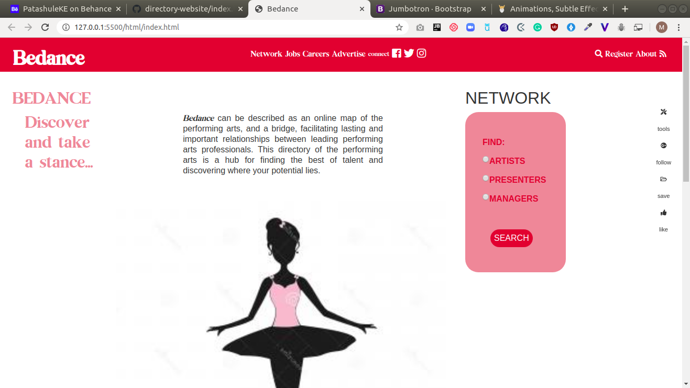

# directory-website

This is a capstone project at the end of the main HTML/CSS curriculum at [Microverse](https:www.microverse.org/) - @microverseinc.

# directory-website

## Built With

- HTML5 
- CSS3
- Bootstrap v4.4.1 

## Description

The task was to build a directory website according to the design on this [website](https://www.behance.net/gallery/25563385/PatashuleKE).

This project is mainly about designing a responsive website similar to a real-life project built with particular business requirements in mind.

## Live Demo

[Live Demo](https://rawcdn.githack.com/Bluette1/directory-website/8bdd8a15fac58ada575593662b5d4d83bef0b507/html/index.html)

## Authors

👤 **Marylene Sawyer**
- Github: [@Bluette1](https://github.com/Bluette1)
- Twitter: [@MaryleneSawyer](https://twitter.com/MaryleneSawyer)
- Linkedin: [Marylene Sawyer](https://www.linkedin.com/in/marylene-sawyer-b4ba1295/)

# Acknowledgements
- The design was created by <a href="https://www.behance.net/mathewnjuguna">Mather Njuguna</a> and  <a href="https://www.behance.net/aweSam"> Sam Achola </a>on behance.
- You can view the design template used <a href="https://www.behance.net/gallery/25563385/PatashuleKE">on behance</a>.
- The images used were retrieved from [CreateMePink](http://www.createmepink.com/).

## 🤝 Contributing

Contributions, issues and feature requests are welcome!

Feel free to check the [issues page](https://github.com/Bluette1/directory-website/issues).

## Show your support

Give a ⭐️ if you like this project!

## 📝 License

This project is [MIT](https://opensource.org/licenses/MIT) licensed.